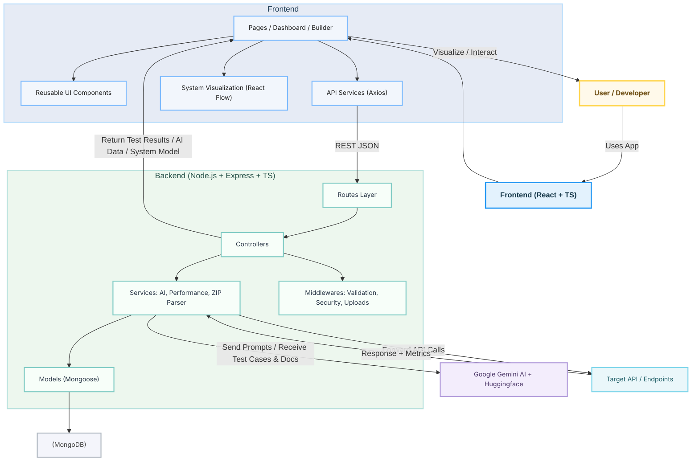

# 🎨 Visual API Testing Platform — Frontend  
### React + TypeScript + Tailwind CSS

This is an interactive, highly visual application that powers API testing, system design visualization, test case rendering, and real-time API interactions. It is engineered with a modular architecture focused on scalability, usability, and performance.

---

# 📦 Features

- 🚀 **Visual API Builder** — Drag-and-drop interface for constructing API workflows  
- 🤖 **AI Test Case Viewer** — Display structured test cases generated by AI  
- 🧠 **System Design Visualization** — Interactive graph-based architecture diagrams using React Flow  
- ⚡ **Performance Test Dashboard** — Real-time charts for latency, throughput, error rate  
- 🎨 **Modern UI/UX** — Tailwind-powered responsive layouts  
- 🔌 **Unified API Service Layer** — Isolated Axios wrapper for streamlined backend communication  

---

# 🧱 Folder Structure

```

fe/
├── public/
├── src/
│   ├── components/      # Shared UI primitives
│   ├── pages/           # Top-level route pages
│   ├── services/        # API wrappers (Axios)
│   ├── hooks/           # Custom React hooks
│   ├── utils/           # Helpers, formatters, validators
│   ├── types/           # Global TypeScript interfaces
│   └── styles/          # Tailwind configs & globals
└── package.json

````

---

# 🛠️ Tech Stack

- **React + TypeScript**
- **Tailwind CSS**
- **Axios**
- **React Flow** (graph visualization)
- **React Hooks**
- **Vite / CRA** (based on your setup)

---

# 🖥️ Local Development

## 1️⃣ Clone the Repository
```bash
git clone https://github.com//SwitchBladeAK/apitesterfe.git
cd api_tester_project/fe
````

## 2️⃣ Install Dependencies

```bash
npm install
```

## 3️⃣ Setup Environment Variables

Create `.env` using the template:

```bash
cp .env.example .env
```

### Required ENV Keys:

```env
REACT_APP_BACKEND_URL=http://localhost:5000
```

> ⚠️ **Make sure the backend is running** before using the app.

---

# 🚀 Run Development Server

```bash
npm start
```

Runs the app at:
📌 **[http://localhost:3000](http://localhost:3000)**

---

# 🏗️ Production Build

```bash
npm run build
```

Build output goes to:

```
fe/build/
```

---

# 🧪 Testing (Optional Setup)

You can use:

* **Jest**
* **React Testing Library**

```bash
npm test
```

---

# 🧰 Available Scripts

| Command         | Description          |
| --------------- | -------------------- |
| `npm start`     | Run dev server       |
| `npm run build` | Build for production |
| `npm test`      | Run test suite       |
| `npm run lint`  | Lint code (optional) |

---
# 🌐 Architecture Diagram



---
